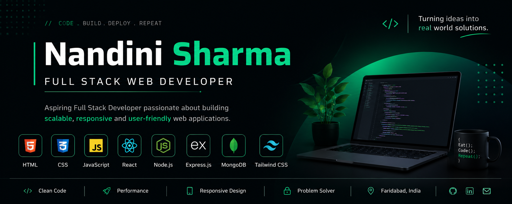

<!-- ===================== Banner ===================== -->

  

<!-- ===================== Introduction ===================== -->

<h1 align="center">Hi 👋, I'm Nandini Sharma</h1>

<h3 align="center">
Aspiring Full Stack Web Developer • MERN Stack Enthusiast • Passionate About Building Modern & Responsive Web Applications 🚀
</h3>

  

---

## 👩‍💻 About Me

- 🎓 Final Year Computer Science Engineering Student
- 💻 Passionate about building clean, scalable and user-friendly web applications.
- 🚀 Continuously learning modern web technologies and best development practices.
- 🌱 Currently expanding my knowledge in Backend Development and Full Stack Architecture.

---

## 🚀 Currently Building

### 🛒 Amazon Clone

A responsive e-commerce application built with:

- ⚛️ React.js
- 🧭 React Router
- 💛 JavaScript (ES6+)
- 🎨 Tailwind CSS

### Current Features

- ✅ Reusable Components
- ✅ Responsive UI
- ✅ Product Pages
- ✅ Routing

### Coming Soon

- ⏳ Shopping Cart
- ⏳ Authentication
- ⏳ Backend Integration

---

## 🌱 Currently Learning

- JavaScript (Advanced ES6+)
- React.js
- Node.js
- Express.js
- MongoDB
- Firebase
- REST APIs
- Tailwind CSS

---

## 🤝 Open to Collaborate On

- Open Source Projects
- MERN Stack Applications
- React.js Projects
- JavaScript Libraries

---

## 💡 Looking to Learn More About

- Backend Architecture
- Authentication
- Docker
- CI/CD
- API Security
- Cloud Deployment

---

## 📂 Featured Links

👨‍💻 **GitHub**

https://github.com/student-BPSMV

📄 **Resume**

https://github.com/student-BPSMV/student-BPSMV/blob/main/NANDINI%20SHARMA_RESUME_09-07-26.pdf

📫 **Email**

**sharmanandini294@gmail.com**

---

## 💬 Ask Me About

- HTML
- CSS
- JavaScript
- React.js
- Node.js
- Express.js
- MongoDB
- Responsive Web Design
- Git & GitHub

---

## 🌐 Connect With Me

---

# 🛠️ Languages & Tools

---

# 📊 GitHub Analytics

---

---

---

## 🎯 2026 Goals

- ✅ Become a MERN Stack Developer
- ✅ Build Production-Ready Full Stack Applications
- ✅ Contribute to Open Source
- ✅ Learn Docker & CI/CD
- ✅ Secure a Software Developer Role

---

> **"I enjoy transforming ideas into modern, responsive, and meaningful web applications while continuously learning new technologies."**

